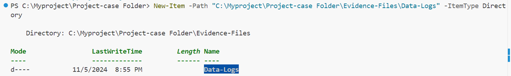
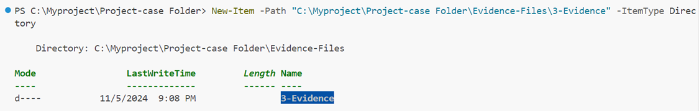
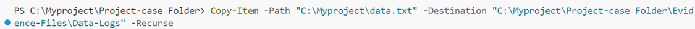
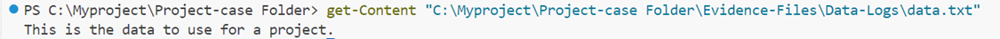
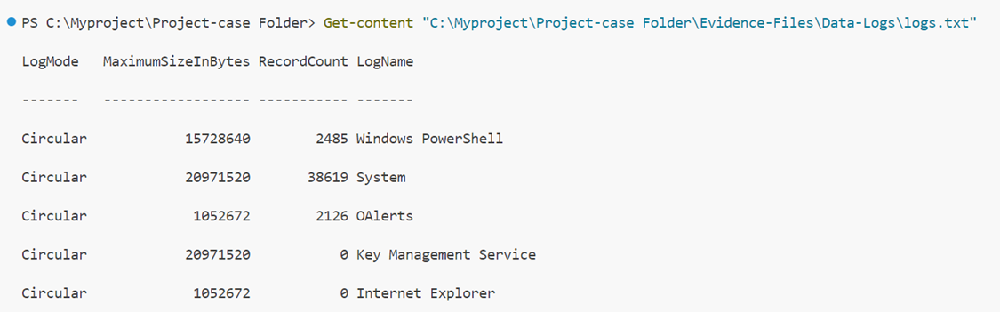
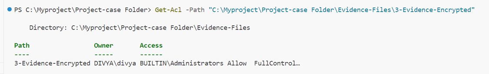
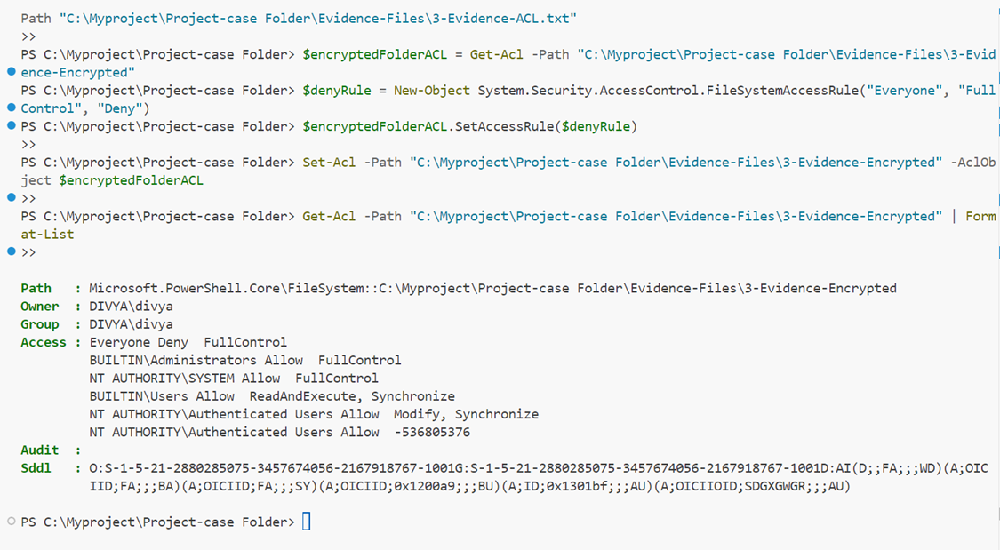
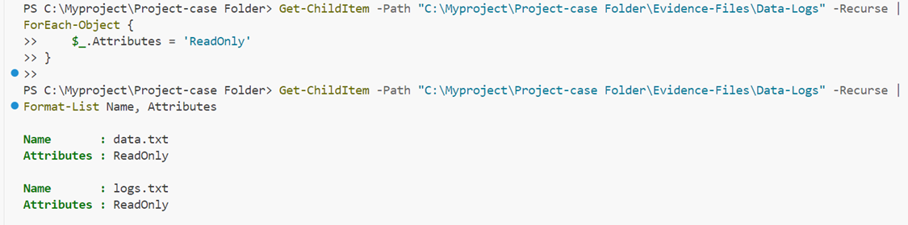
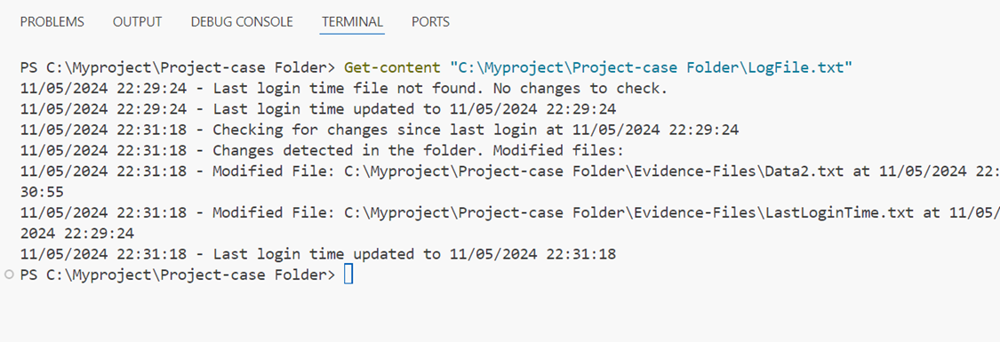

# df-mod3-sdm
# Divya

# Project Name: PowerShell File Management and Forensic Exploration

## Project Overview
This project demonstrates using PowerShell commands for managing files and folders, working with file contents, and exploring file permissions. It includes practical examples, scripts, and outputs to illustrate key skills in handling and securing data.

## Secure Data Management

## PowerShell Commands for Working with Files and Folders
Below is the list of some of the commands learnt over this course:

### Notes on Commands
1.	Creating and Managing Directories
To organize evidence and logs, create directories to separate different types of files:
-  Creates new files or directories -  * New-Item -Path . -Name "NewFolder" -   ItemType Directory

# Create subdirectories for logs and evidence 
New-Item -Path "C:\Project-Case-Folder\Evidence-Files\Data-Logs" -ItemType Directory 

 

New-Item -Path "C:\Project-Case-Folder\Evidence-Files\Evidence" -ItemType Directory

New-Item -Path "C:\Myproject\Project-case Folder\Evidence-Files\3-Evidence" -ItemType Directory

Copied and created backup files Data.txt file 

Display the content to make sure it copied and created backup files

Copied and created backup files logs.txt file 

![alt text]image-9.png)

Display the content to make sure it copied and created backup files

## Manage Permissions

# Encrypt the Evidence folder
$sourceFolder = "C:\Myproject\Project-case Folder\Evidence-Files\3-Evidence"
$encryptedFolder = "C:\Myproject\Project-case Folder\Evidence-Files\3-Evidence-Encrypted"
Copy-Item -Path $sourceFolder -Destination $encryptedFolder -Recurse

# Retrieve the ACL for the Evidence folder

In digital forensics, controlling file permissions is essential to maintain integrity, confidentiality, and chain of custody of evidence. By applying strict access controls, investigators can prevent unauthorized modifications, document who accessed the evidence, and support the evidence’s admissibility in court. Using commands to set and record permissions ensures compliance with legal standards and reinforces trust in the investigation's processes, safeguarding evidence from tampering and upholding its credibility.
Example of setting ACL:

# Get the current ACL for the folder
$encryptedFolderACL = Get-Acl -Path "C:\Myproject\Project-case Folder\Evidence-Files\3-Evidence-Encrypted"

# Create a new access rule that denies "Everyone" full control
$denyRule = New-Object System.Security.AccessControl.FileSystemAccessRule("Everyone", "FullControl", "Deny")

# Add the rule to the current ACL
$encryptedFolderACL.SetAccessRule($denyRule)

# Apply the modified ACL to the folder
Set-Acl -Path "C:\Myproject\Project-case Folder\Evidence-Files\3-Evidence-Encrypted" -AclObject $encryptedFolderACL

Set the files to "read-only" and Verify that the files are now "read-only":

## PowerShell Scripting
Created Script to see if/what changes were made to the Evidence folder. This would help to see every time this folder was accessed and what changes were made. 

Script output 

